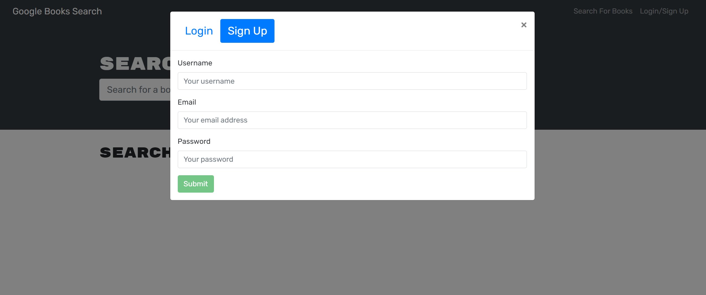
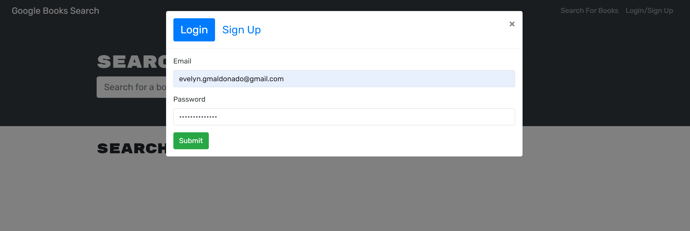
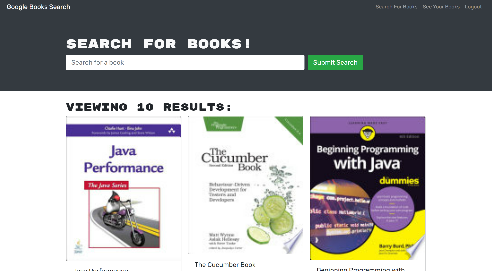
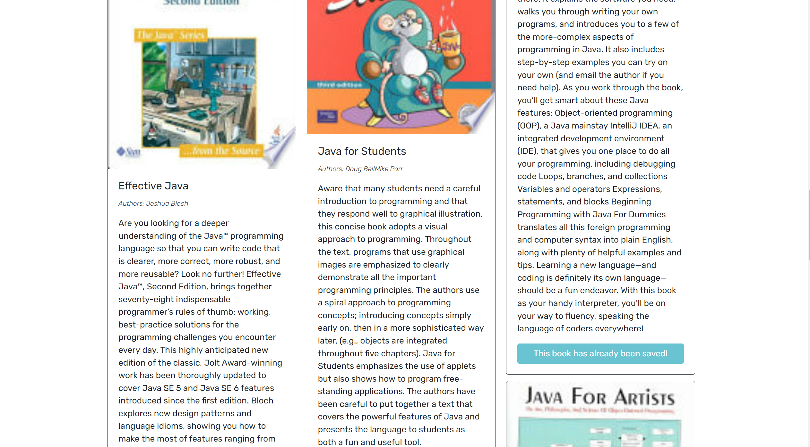
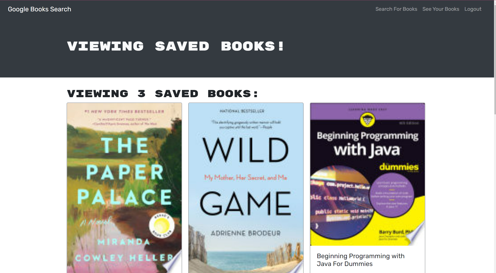

# BookSearch_engine

## Table of contents
1. [Description](#description)
2. [Installation](#installation)
3. [Usage](#usage)
4. [License](#license)
5. [Credits](#credits)
6. [Tests](#tests)
7. [Questions](#questions)
8. [More](#more)

<h2 id="description"> Project Description </h2>
Book Search Engine is an application that allows the users searching for their favorite books; we use Google API and MERN stack connected by React apollo.

## Installation 
Some of the tools utilized to develop Book Search Engine are: nodeJS, MongoDB, Mongoose, Apollo, React, Graphql and Google Book API.

## Usage 
When the user visits Search Book Engine App, they will presented with the option to signup, login and search for books. Once el user has logged in, then they will have the option to save a book, delete a book and see their saved book list. Every book comes with the next information: title, author, description and image of the book.

## License 
This application is covered under the GNU GPLv3.0 License.

## Credits 
Evelyn G Maldonado.

## Tests 
No tests.

## Questions 
If you have any questions, please contact me to the information listed below.

* Email: evelyn.gmaldonado@gmail.com
* GitHub: [EvelynGMaldonado](https://github.com/EvelynGMaldonado)

## More

* Link to the GitHub Repository:
[Book Search Engine](https://github.com/EvelynGMaldonado/BookSearch_engine)

* Url to the deployed application:
[Book Search Engine](https://egm-booksearcher.herokuapp.com/)
